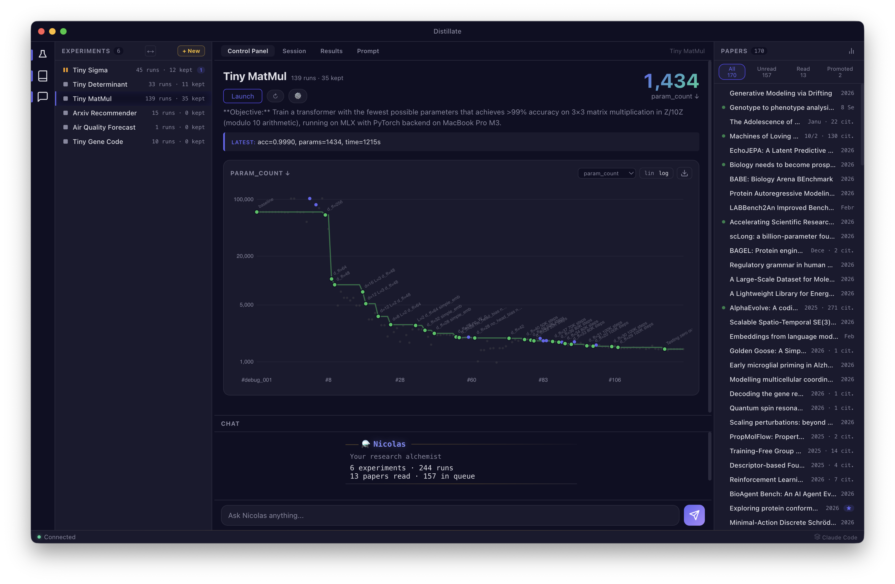

# Distillate

**Your research alchemist.** Conjure ML experiments that run themselves. Distill insights from everything you read.

[](https://pypi.org/project/distillate/)
[](https://www.python.org/downloads/)
[](LICENSE)
&nbsp; [distillate.dev](https://distillate.dev)



## What is Distillate?

Distillate is an open-source research platform that orchestrates autonomous research agents. It turns your research questions into agents that run ML experiments, track results, and report what they find — while keeping your paper library organized with highlights and AI summaries.

At the center is **Nicolas**, your research alchemist. He spawns **research agents** that live in tmux sessions, iteratively improving your models and reporting results. He also tends **the library** — your paper collection, flowing from Zotero through any reading surface (reMarkable, iPad, desktop) into structured notes.

The core loop: **read papers, run experiments, see them improve on the chart, distill what you learned, repeat.** What you read informs what you try. What you try informs what you read next.

```
$ distillate

  ─── ⚗️  Nicolas ──────────────────────────────
  Your research alchemist.
  🧪 4 experiments · 12 runs · 1 running
  📚 42 papers read · 7 in queue

> /conjure tiny-matmul --duration 30m
  🧪 Spawning research agent...
  Created distillate-xp-tiny-matmul
  Research agent spawned — 30 min budget, will report when done.

> /distill tiny-matmul
  🔬 Distilling 8 runs...
  Best: run-7 (loss 0.0023, -42% from baseline)
  Key insight: block size 64 with gradient accumulation
  outperforms larger batches on this scale.
```

## Skills

Nicolas responds to 9 skills organized across three roles:

### The Laboratory 🧪

| Skill | Description |
|-------|-------------|
| `/conjure` | Summon a research agent — launch an experiment from a research question |
| `/steer` | Guide a running agent — adjust goals or change direction |
| `/assay` | Deep analysis of experiment results with cross-run comparison |
| `/distill` | Extract insights from an experiment's session histories |
| `/survey` | Scan all experiments for new runs and breakthroughs |
| `/transmute` | Turn paper insights into experiment ideas |

### The Library 📚

| Skill | Description |
|-------|-------------|
| `/brew` | Sync papers, process highlights, refresh the library |
| `/forage` | Discover trending papers and reading suggestions |
| `/tincture` | Deep extraction from a single paper's highlights and notes |

## Quick Start

### Install

```bash
pip install distillate
# or
uv pip install distillate
```

### Requirements

- **Claude Code** (`claude` CLI) — Distillate runs through your Claude Code subscription. No separate API key needed.
- **Zotero** — for paper management (optional if you only run experiments)

### Launch

```bash
distillate          # Start the Nicolas REPL
distillate --init   # Run the setup wizard (first time)
distillate --sync   # Classic sync-only workflow
```

Or use the [desktop app](#desktop-app) for a full IDE experience.

## Desktop App

The Distillate desktop app provides an IDE-style layout with four tabs:

- **Control Panel** — metric chart, session timer, goal tracking, experiment overview
- **Session** — live terminal attached to the running Claude Code agent
- **Results** — runs grid with research insights (key breakthrough, lessons learned, dead ends)
- **Prompt** — view and edit PROMPT.md with markdown rendering

The desktop app connects to the same backend as the CLI — everything stays in sync. [Download for macOS](https://github.com/rlacombe/distillate/releases/latest).

## How It Works

The core research loop:

1. **📜 Add papers** — Save papers to Zotero, read and highlight on any device. Nicolas extracts highlights, generates summaries, and builds your knowledge base.

2. **⚗️ Conjure experiments** — Describe a research question or point at a paper. Nicolas drafts the prompt, sets up a git repo, and spawns an autonomous research agent to run it.

3. **🔬 Distill insights** — As experiments run, Nicolas tracks every iteration with metrics, diffs, and decisions. Distill the results to see what worked, what didn't, and why.

4. **✨ Transmute findings** — Connect paper insights to experiment results. What you read informs what you try next. The cycle continues.

Every experiment lives in a git repo. Every paper lives in your Zotero library. Notes are plain markdown. There's no lock-in — Distillate enhances your existing tools.

## Configuration

All settings live in `~/.config/distillate/.env`. See [.env.example](.env.example) for the full list.

The setup wizard (`distillate --init`) walks you through connecting Zotero, choosing a reading surface, and configuring optional features.

For advanced configuration, engagement scores, scheduling, and GitHub Actions automation — see the [Power users guide](https://distillate.dev/power-users.html).

## Development

```bash
git clone https://github.com/rlacombe/distillate.git
cd distillate
uv venv --python 3.12
source .venv/bin/activate
uv pip install -e .
pytest tests/
```

## License

MIT
